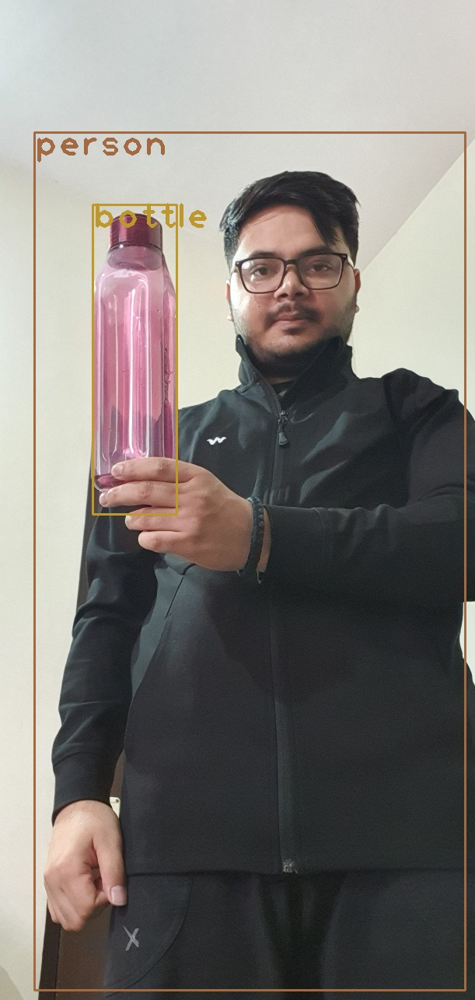
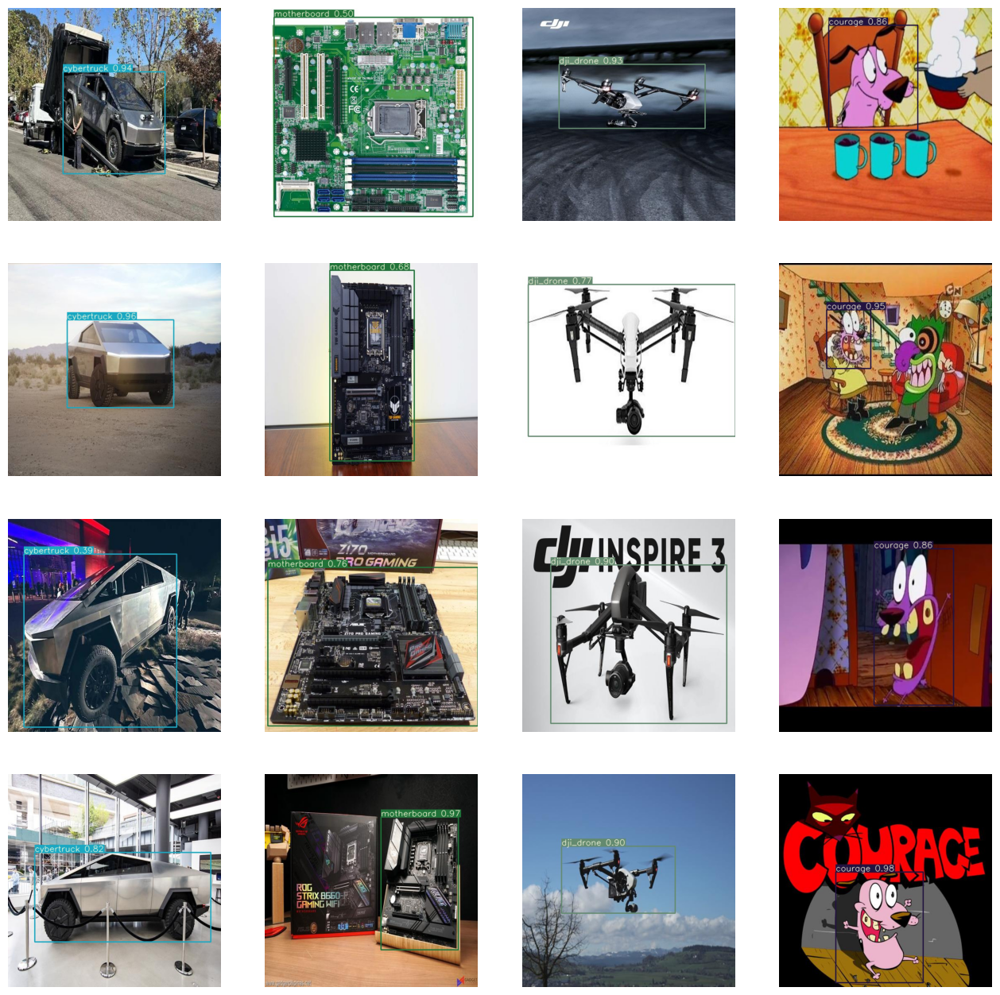

# EVA-8_Phase-1_Assignment-12
This is the assignment of 12th session in Phase-1 of EVA-8 from TSAI

## Introduction

### Objective
Objective of this assignment is to work with Yolo model. Below are the sub objectives:
1. Run inference on pre-trained Yolov3 model using OpenCV and use your own image holding objects from COCO dataset.
2. Pre-trained Yolov3 on custom dataset containing 4 classes and total of 200 images. Annotate this 200 images as well.
3. Run this Yolov3 model on a youtube downloaded video containing any of the four classes and upload this video back to youtube and share the link.
4. share the repo with all implementation, notebook with code and results images.
4. **Bonus-part**: Use the same custom dataset of 200 images and train a Yolov4 model.

### Getting started
- All notebooks are self contained means opening it on colab and running each cell should re-create the same results although the models are trained localy.
- There are cells in the notebook which is modifying some code line as some of the repo's are old and need some modification.
### Repository 
Compelete assignment implementation is divided into three parts both in README as well as in the repository folder.

#### Part-1
- OpenCV based inference implementation of Yolov3.
- Generated image on custom image holding COCO object.

#### Part-2
- Annotate custom collacted data of 4 classes.
- Train a Yolov3 model on that.

#### Part-3
- Download youtube video containing any of four classes.
- generate frames using FFMPG and infer over the frame using custom trained model.
- upload this video back to youtube and share the link.

## Dataset representation
As mentioned above, here 200 images of 4 custom classes are collected. This four classes are -

 **cybertruck**, **motherboard**, **dji_drone**, **courage**.
<br>
Below is the image showing the data we used for this classes.

This dataset are also added as a zip file in this repo in `Part_2-training_on_custom_dataset/deveshcustom_512.zip`

## About YOLO (You Only Look Once)
YOLO (You Only Look Once) is a real-time object detection model that uses a single neural network to predict the bounding boxes and class probabilities of objects in an image. Unlike traditional object detection algorithms that perform region proposals and classification separately, YOLO divides the input image into a grid of cells and predicts the bounding boxes and class probabilities directly from the grid cells. This makes YOLO extremely fast and accurate, with the ability to process up to 60 frames per second on a GPU. YOLO has become a popular model for real-time object detection tasks, such as autonomous driving, surveillance, and robotics.
<br>
Below image shows a architecture of famous Yolov3 model.


## PART-1: OpenCV based YOLOv3 inference
notebook `part_1-OpenCV_Yolo/Yolo_with_OpenCV.ipynb` contains code in which we first download the weights and config file of Yolov3 and then load the model and convert the image into blob. Run the inference on the image parse the output to get the bounding boxes and then finally overlay it on the input image.
### Image output from OpenCV inference


## PART-2: Training YOLOV3 on custom dataset
Part-2 is the interesting part of the assignment where we train Yolov3 on collected dataset. This model is trained for 500 epochs.
```
Epoch   gpu_mem      GIoU       obj       cls     total   targets  img_size
   499/499     8.75G     0.542     0.276     0.054     0.871        16       512
               Class    Images   Targets         P         R   mAP@0.5        F1
                 all         9         9     0.786     0.943     0.995     0.842
```
Below is the image containing output infered images on 16 test data points.
### Plot showing 16 output images


## PART-3: Inference on Youtube video
This is part 3 where we used the above trained model and FFMPEG to infer on individual frames of youtube downloaded video and the uploaded it back.
<br>
Here I have used two videos:
- First one contain video clip of Courage the cowardly dog from a episord.
- Second one contain video clip of Cybertruck commercial.

NOTE: Due to lack of data (20 image for each class) the output results are not great and this can been seen clearly as model is not able to identify courage facing his back as the dataset does not contain such annotated image. Hence it can be further improved by adding more dataset.
### Class - Courage (the cowardly dog)
[](https://www.youtube.com/watch?v=Vnumdu73oUI)

### Class - Cybertruck (truck from the future)
[](https://www.youtube.com/watch?v=lrXfjzat3po)


## PART-Bonus: Training YOLOV4 model on custom dataset
### Trained using notebook
This is the bonus part where we use Roboflow to train Yolov4 model.
Notebook `Bonus_part-YoloV4_training/YOLOv4_Roboflow_PyTorch.ipynb` contains code to train the model for 100 epochs.

- First annotated images were uploaded to Roboflow.
- Then format was converted into specific format.
- Here also some file correction was required in the code as the impelementation is old and uses old python and pytorch version.
<br>
NOTE- Somehow the results were not good and the starting error was too high. Going through the repo, it seems that a lot of people were facing this issues and augmentation is also creaing issues.

### Trained using Roboflow
To get good results on Yolov4, I trained the model directly on roboflow by uploading my dataset.
Below are few images of the matrix generated by roboflow.
 - Dashboard image
    
 - Training graphs
    
